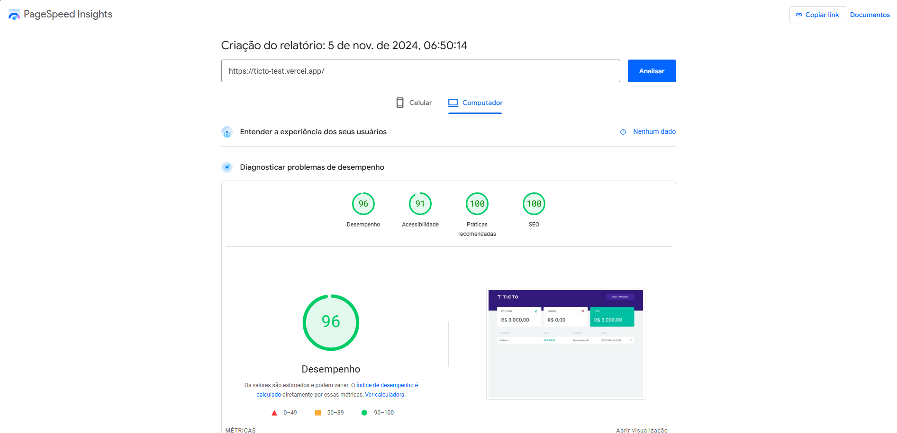
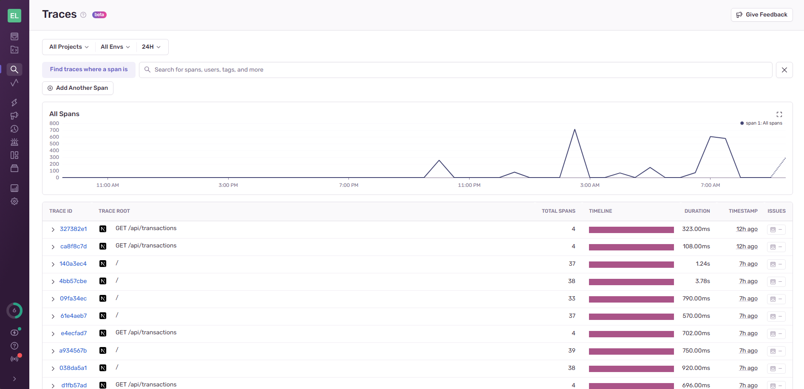
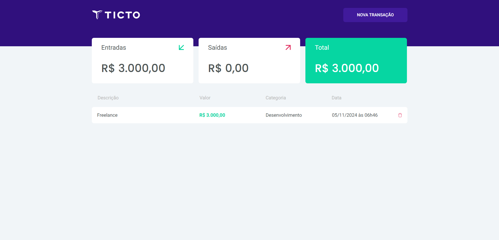

   

 

  Finance. Project developed during challenge of ticto

   Made by
    <a href="https://github.com/elvislisboa">Elvis Lisboa.
  

# Contents

- [Screenshots](#camera-screenshot)
- [Technologies](#rocket-technologies)
- [How to Run](#computer-how-to-run)
- [Issues](#bug-issues)
- [Contributing](#sparkles-issues)
- [License](#page_facing_up-license)

# Screenshots

   
   
   

# Technologies

This project was made using the follow technologies:

- [Typescript](https://www.typescriptlang.org/)
- [NextJs](https://nextjs.org/)
- [Saas](https://sass-lang.com/)
- [Sentry](https://sentry.io/welcome/)
- [Jest](https://jestjs.io/pt-BR/)
- [React Test Library](https://testing-library.com/docs/react-testing-library/intro/)
- [Github Actions](https://docs.github.com/en/actions)
- [React Hook Form](https://www.react-hook-form.com/)
- [Zod](https://zod.dev/)

# How to run

# Clone Repository
$ git clone https://github.com/elvislisboa/ticto-test

# Install Dependencies
$ yarn

# Run Aplication
$ yarn start

# Run Test
$ yarn test

  Go to http://localhost:3000/ to see the result Web.

# Issues

Create a <a href="https://github.com/elvislisboa/issues">new issue report</a>, it will be an honor to be able to help you solve and further improve our application.

# Contributing

- Fork this repository;
- Create a branch with your feature: git checkout -b my-feature;
- Commit your changes: git commit -m 'feat: My new feature';
- Push to your branch: git push origin my-feature.

# License

This project is under the [MIT license](./LICENSE).
Made by [Elvis Lisboa](https://github.com/elvislisboa).

Thank you! 🌠

# See website in deploy

\*[Deploy Vercel](https://ticto-test.vercel.app/)
